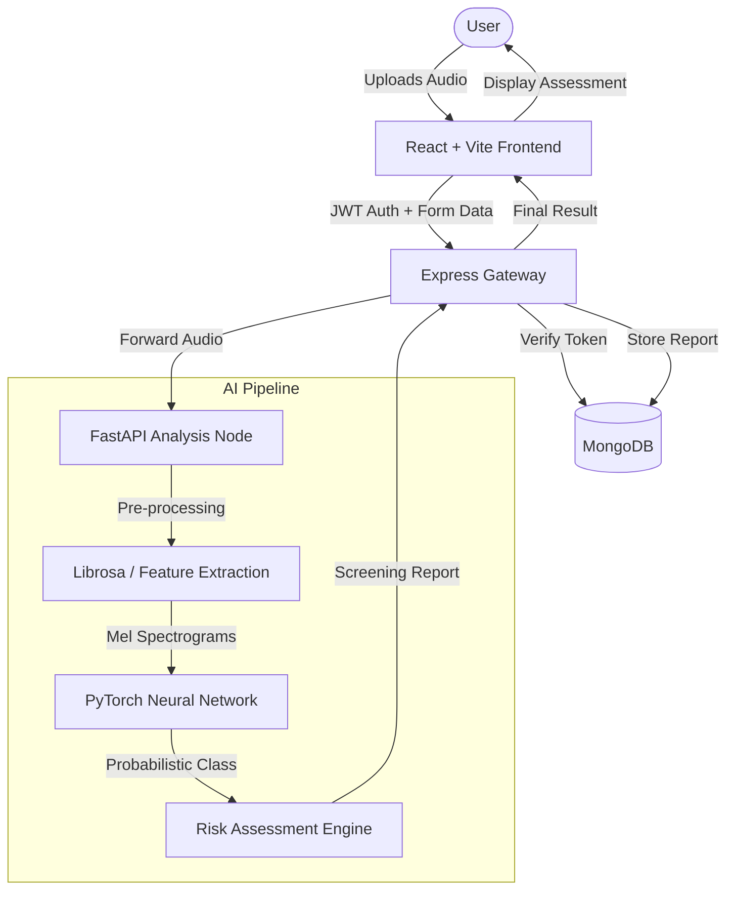

# RespiraScan

### AI-Powered Respiratory Risk Screening from Voice Biomarkers

---

## Problem Statement
Respiratory diseases often go undetected in early stages, leading to severe complications and increased healthcare costs. Traditional diagnostic methods like spirometry require clinical visits and specialized equipment, making frequent monitoring difficult for high-risk populations. There is a critical need for a non-invasive, accessible, and fast screening tool that can identify early acoustic biomarkers of respiratory distress using standard hardware.

## Solution Overview
RespiraScan is an advanced screening platform that leverages Artificial Intelligence to analyze voice and breathing patterns. By utilizing neural networks trained on thousands of clinical audio samples, the system detects subtle acoustic signatures associated with conditions such as Asthma, COPD, and Pneumonia. Users can upload a short audio clip and receive a preliminary risk assessment in real-time, facilitating early intervention and data-driven healthcare decisions.

## Key Features
- **Acoustic Biomarker Analysis**: Extraction of spectral and temporal features from audio samples.
- **AI-Driven Risk Scoring**: Neural network models built to identify subtle respiratory anomalies.
- **Secure Clinical History**: Encrypted storage of past screenings for long-term health tracking.
- **Real-time Processing**: Fast inference pipeline delivering results in seconds.
- **Privacy-First Design**: Enterprise-grade encryption and temporary file processing.

## Tech Stack

## Architecture

## API Overview

### Authentication
- `POST /api/auth/register`: Create a new clinical user account.
- `POST /api/auth/login`: Authenticate and receive a JWT token.

### Analysis & Data
- `POST /api/analyze`: Submit audio samples for AI risk assessment (Protected).
- `GET /api/history`: Retrieve user-specific screening history (Protected).
- `GET /api/fastapi-data`: Health check for neural infrastructure nodes.

## Database Schema
The system utilizes a Document-based schema in **MongoDB** :
- **User Collection**: Stores hashed credentials, profile metadata, and security settings.
- **Analysis Collection**: Linked to User IDs, storing audio metadata, extracted feature summaries, and AI inference results.
- **Audit Logs**: Maintains system access records for compliance and security monitoring.

## Security Measures
- **HTTPS/TLS**: All data in transit is encrypted using modern cryptographic protocols.
- **JWT Authentication**: Stateless session management with securely signed tokens.
- **Password Hashing**: Industry-standard **bcrypt** (10 salt rounds) for sensitive credential storage.
- **File Validation**: Strict multi-modal checking of audio types and sizes to prevent injection.
- **Ephemeral Storage**: Audio files are processed in-memory or deleted immediately after feature extraction.
- **Input Sanitization**: Robust validation of all API payloads to mitigate XSS and NoSQL injection.

---

## Medical Disclaimer
**RespiraScan is a screening support tool and is NOT intended to provide a medical diagnosis.** The results generated by the AI model are probabilistic assessments based on acoustic biomarkers and should be reviewed by a qualified healthcare professional. Always seek the advice of a physician for any medical condition or treatment.

## License
This project is developed for clinical research and academic demonstration purposes. All rights reserved.

---
*Developed with precision for the future of respiratory digital health.*
